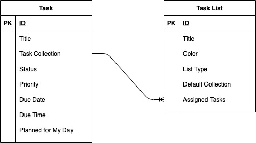

# Todoey

This monorepo contains a collection of apps and services all implementing a simple task management application.
This single implementations use SAP technology from the SAP Business Technology Platform.

## Domain Model

### Task

The Task entity is what you think it is, an item to note a specific activity or reminder and assign it a due date.

Invariants:

- ID is the unique primary key.
- If Due Time is not null, Due Date must also not be null.
- Status must not be null.
- Task Collection must not be null, i. e. a task must be assigned to a task collection.

A task‘s Priority can have following values.

| Code | Name     |
| ---- | -------- |
| 1    | High     |
| 3    | Moderate |
| 5    | Low      |

A task’s Status can have following values.

| Code | Name      |
| ---- | --------- |
| O    | Open      |
| D    | Done      |
| X    | Cancelled |

Specifications:

- Status cannot be CREATED or UPDATED.
- Status is initially set to O (open).
- Status can be changed by specific actions: set to done, cancel, reopen.
- Due Time cannot be CREATED if Due Date is not CREATED as well.
- Due Time cannot be UPDATED if Due Date is not set.
- A task cannot be DELETED, if the status is D (done) or X (cancelled).

### Task List

A task list is listing and grouping multiple tasks together. There a multiple types, the ordinary task collections where tasks are assigned to, and so-called views. Tasks are not assigned to such views directly but implicitly due to view-specific rules. For example, the My Day view is listing tasks that are planned for my day or due today.

Invariants:

- ID is the unique primary key.
- Color must conform to the RGB hex string pattern.
- There must be exactly one default task collection.

The List Type of a task list can have following values.

| Code       | Name            |
| ---------- | --------------- |
| COLLECTION | Task collection |
| MY_DAY     | My day view     |
| TOMORROW   | Due tomorrow    |

Specifications:

- All task lists except collections are read-only.
- If a task collection is CREATED or UPDATED and set as default, the existing default task collection has to be updated to.
- The default task collection cannot be DELETED.
- A task collection that references tasks cannot be DELETED.

Task list views assemble their assigned tasks based on business rules.

| List Type | Rule for Assigned Tasks                       |
| --------- | --------------------------------------------- |
| MY_DAY    | Tasks that are planned for today or due today |
| TOMORROW  | Tasks with tomorrow as due date               |
