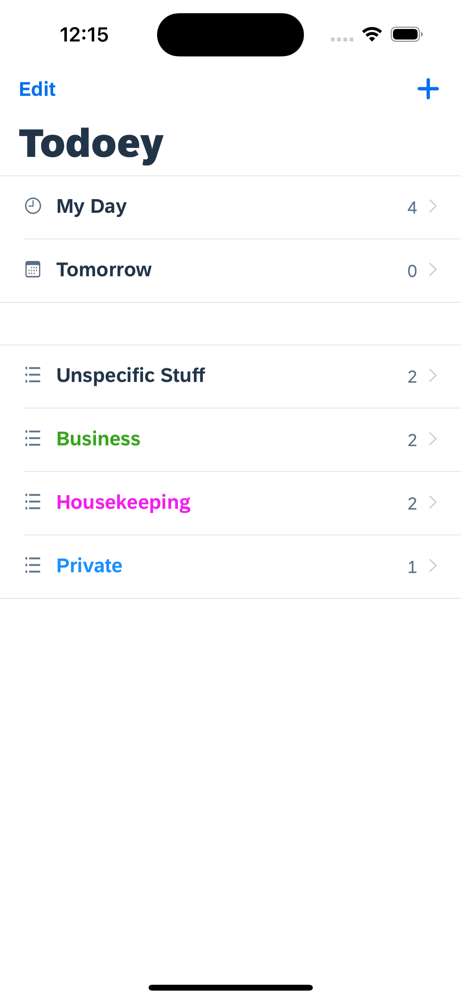
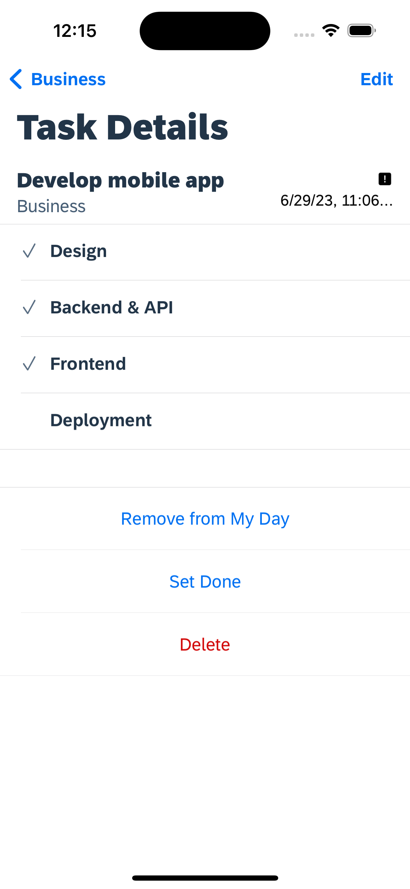
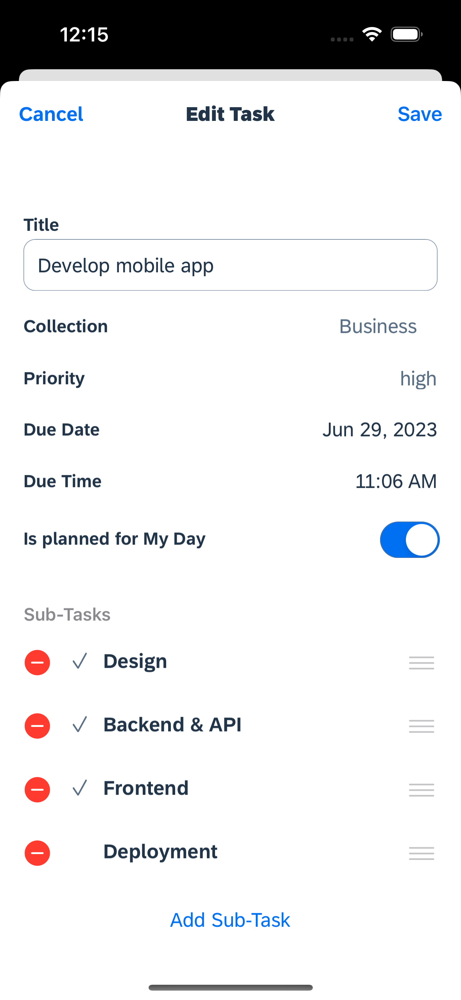
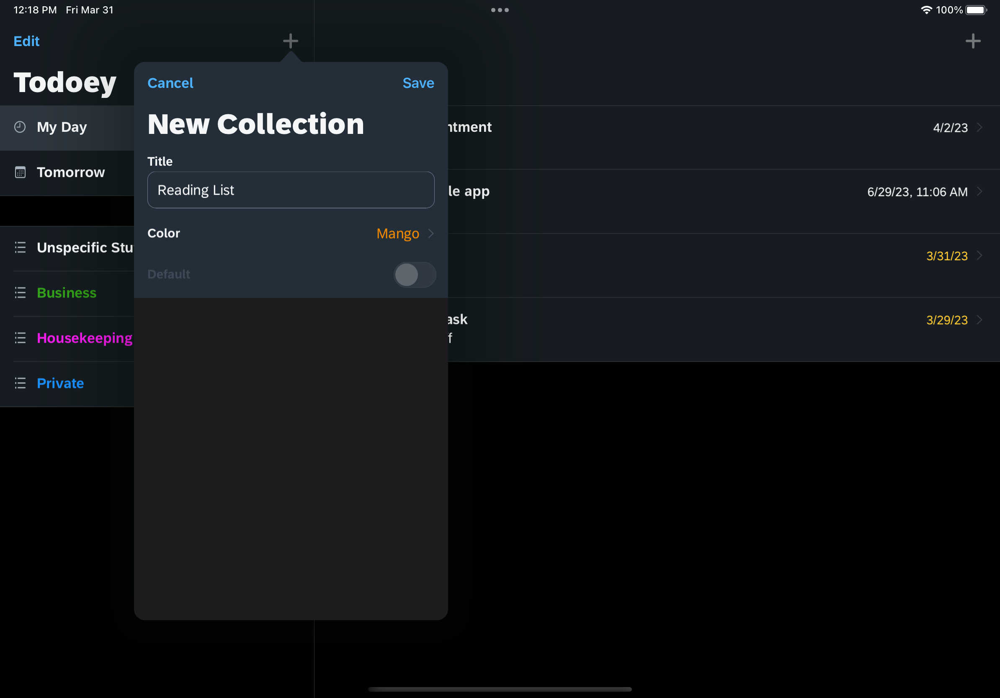
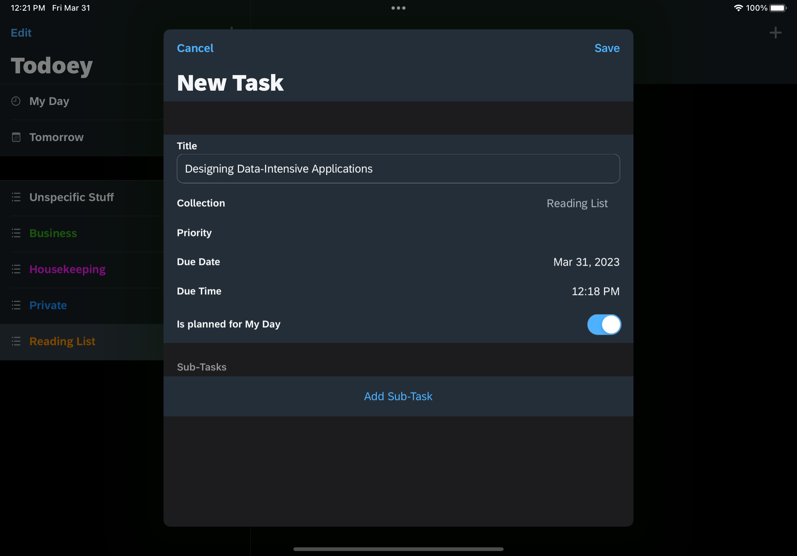
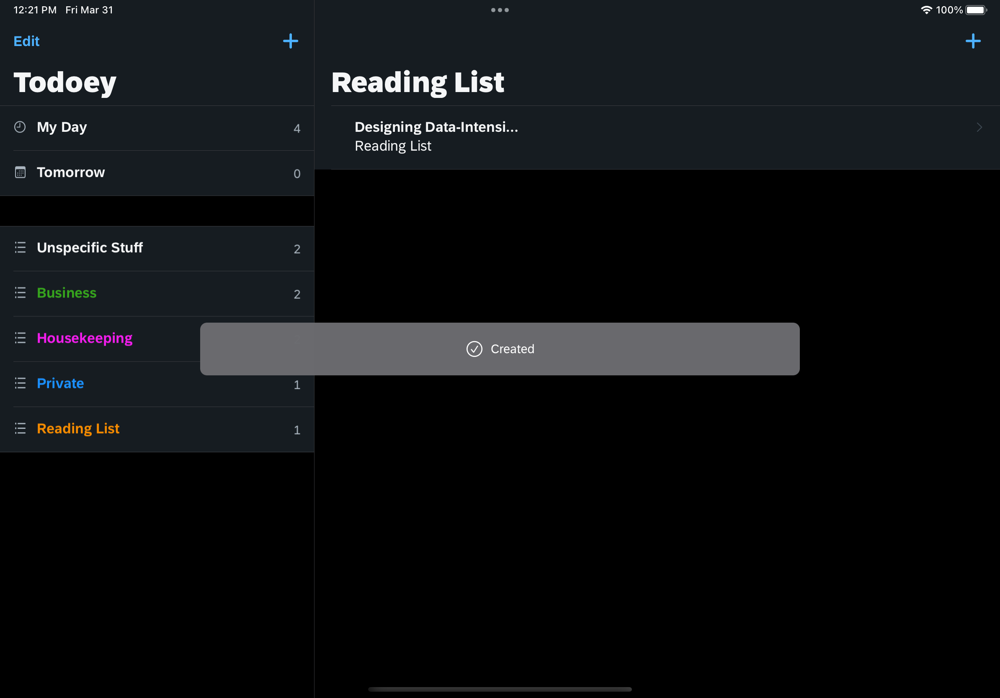
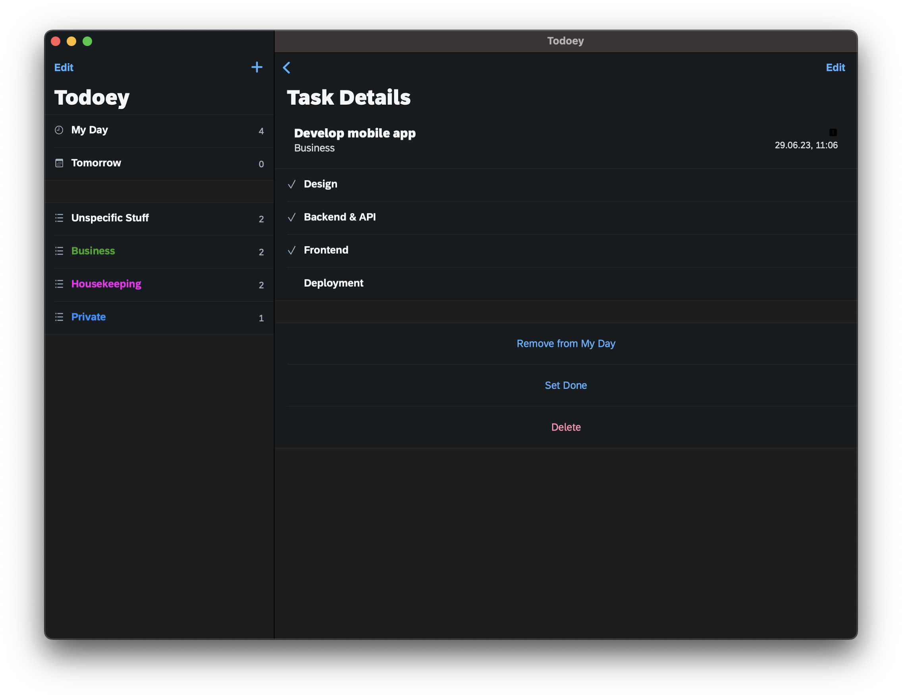

# SAP BTP SDK for iOS

This project implements Todoey as a native mobile app with the [SAP BTP SDK for iOS](https://community.sap.com/topics/mobile-technology/btp-sdk-ios). It consumes the Task service from the [CAP Node.js backend](../../../cap-nodejs). The app supports iOS, ipadOS and macOS (via Mac Catalyst).

## On iPhones

Display all task lists.

Display a task's detailed information.

Edit the details of a task.

## On iPads

Add a new task collection.

Add a new task to the collection.

Backend confirms that the task was created.

## On Macs

